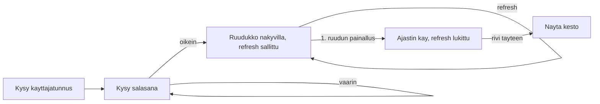

# Pispala Bingo

Mobiili-first bingopeli (Vue 3 + Vite) Tampere/Pispala-teemalla, SNES-pikselityylillä. Pelin tila säilyy localStoragessa, joten peliä voi jatkaa selaimen sulkemisen jälkeen. Julkaisu GitHub Pagesiin GitHub Actions -workflow'lla.

## Teknologiat
- Vue 3 (`<script setup>`, Composition API)
- Vite (build + dev-serveri), `base: './'` jotta GitHub Pages toimii ilman repo-nimen kovakoodausta
- Google Fonts: "Press Start 2P" (pikselifontti), `image-rendering: pixelated`, SNES-väripaletti
- Ei ulkoisia tilakirjastoja; oma composable + localStorage

## Pelin tilakone (vaiheet)

Tila tallennetaan jokaisessa vaiheessa localStorageen (avain esim. `pispala-bingo-v1`): `username`, `grid` (25 sanaa), `marked` (25 boolea), `phase`, `startTime`, `endTime`. Lataussivulla tila luetaan takaisin -> peli jatkuu siitä mihin jäi. Kesto lasketaan `endTime - startTime` (todellinen kelloaika, kestää myös selaimen sulkemisen yli).

## Salasanavaihe
Käyttäjätunnuksen syötön jälkeen kysytään salasana ennen ruudukkoon pääsyä. Salasana on kovakoodattu ja aina sama: `hervantaralli`. Väärä salasana näyttää virheilmoituksen eikä päästä eteenpäin. Kun salasana on oikein, siirrytään `ready`-vaiheeseen. Onnistunut kirjautuminen tallennetaan localStorageen (esim. `unlocked: true`), jotta selaimen uudelleenavaus ei kysy salasanaa uudestaan. Vakio määritellään helposti ylläpidettäväksi (esim. `src/data/bingoWords.js` tai oma `config`-vakio).

## Voittoehto
Yksi täysi rivi: mikä tahansa vaaka, pysty tai jämpäti diagonaali (5 putkeen). Tarkistus 5x5-matriisista jokaisen painalluksen jälkeen.

## Refresh-logiikka
`phase === 'ready'` -tilassa "Sekoita ruudukko" -nappi arpoo uudet 25 sanaa sanalistasta. Ensimmäinen ruudun painallus siirtää tilaan `playing`, käynnistää ajastimen ja piilottaa/poistaa refresh-napin käytöstä.

## Tiedostorakenne
- `index.html` - mount-piste, viewport meta mobiilille
- `package.json`, `vite.config.js`
- `src/main.js` - Vue-app bootstrap
- `src/App.vue` - vaiheiden ohjaus tilakoneen mukaan
- `src/components/UsernamePrompt.vue` - käyttäjätunnuksen kysely
- `src/components/PasswordPrompt.vue` - salasanan kysely (vakio `hervantaralli`)
- `src/components/BingoBoard.vue` - 5x5-ruudukko + sekoitus/ajastin/voittotila
- `src/components/BingoCell.vue` - yksittäinen ruutu (merkitään painamalla)
- `src/composables/useBingo.js` - localStorage-luku/kirjoitus, sanojen arvonta, voittotarkistus, ajastin
- `src/data/bingoWords.js` - **helposti ylläpidettävä sanalista** (Tampere/Pispala-teema) + asetus vapaalle keskiruudulle
- `src/styles/snes.css` - SNES-pikselityyli (fontti, reunat, paletti, napit)
- `.github/workflows/deploy.yml` - build + deploy GitHub Pagesiin
- `.gitignore`, `README.md`

## Sanalista (`src/data/bingoWords.js`)
Yksi taulukko Tampere/Pispala-pubikierrosaiheisia fraaseja (yli 25 kpl, jotta sekoitus arpoo aina eri 25:n joukon). Esimerkkejä: "Pyykältä näkymä järvelle", "Mustamakkara + puolukka", "Pispalan portaat", "Rosendahlin terassi", "Kaljaa Pispalan valtatiellä", "Näkötorni näkyvissä", "Joku tilaa lonkeron", "Pyykkikoski", "Tahmela", "Ratina", "Hervanta-vitsi" jne. Lisäksi `export const useFreeCenter = false` -lippu vapaalle keskiruudulle.

## SNES-tyyli
Tumma tausta, kirkkaat paletit (esim. syaani/magenta/keltainen aksentit), paksut 4px reunat, "korotetut" napit varjostuksella, pikselifontti, merkityt ruudut saavat retro-leiman/värin. Layout skaalautuu puhelimen leveyteen (ruudukko 100% leveys, ruudut neliöitä `aspect-ratio: 1`).

## GitHub Pages -julkaisu
`.github/workflows/deploy.yml`: pushilla `main`-haaraan ajetaan `npm ci && npm run build`, ladataan `dist/` Pages-artefaktiksi ja deployataan. Viten `base: './'` varmistaa toimivat polut. README:hen ohjeet Pagesin käyttöönotosta (Settings -> Pages -> Source: GitHub Actions).

## Toteutusvaiheet (todos)
1. **scaffold** - Pystytä Vite + Vue 3 -projekti: package.json, vite.config.js (base './'), index.html, src/main.js
2. **words** - Luo src/data/bingoWords.js: Tampere/Pispala-sanalista (>25) + useFreeCenter-lippu
3. **composable** - Toteuta src/composables/useBingo.js: localStorage-persistointi, sanojen arvonta, voittotarkistus (rivi/pysty/diagonaali), ajastin
4. **username** - UsernamePrompt.vue: kysy ja tallenna käyttäjätunnus localStorageen
5. **password** - PasswordPrompt.vue: kysy salasana (kovakoodattu `hervantaralli`), virhe väärällä, tallenna onnistunut kirjautuminen localStorageen
6. **board** - BingoBoard.vue + BingoCell.vue: 5x5-ruudukko, sekoitus-nappi (vain ready-tilassa), ajastin, voittonäkymä kestolla
7. **app** - App.vue: ohjaa vaiheet (username -> password -> ready -> playing -> won) tilan perusteella
8. **style** - src/styles/snes.css: SNES-pikselityyli, mobiili-first responsiivisuus, pikselifontti
9. **deploy** - .github/workflows/deploy.yml GitHub Pagesiin, .gitignore, README, git-alustus + alkucommit

## Git
Alustetaan paikallinen repo, lisätään `.gitignore` (node_modules, dist) ja tehdään alkucommit. Käyttäjä yhdistää oman GitHub-remoten ja työntää.
